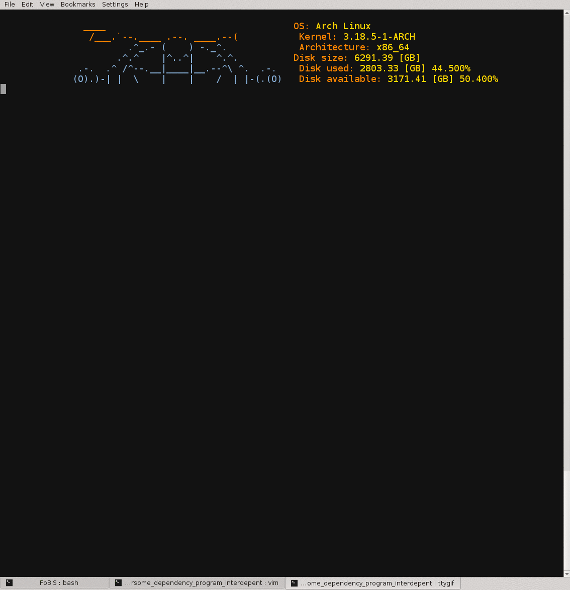

<a name="top"></a>
# FoBiS.py [](https://img.shields.io/pypi/v/FoBiS.py.svg) []()

[]()

### FoBiS.py, Fortran Building System for poor people
A KISS tool for automatic building modern Fortran projects.

### Status
[](https://travis-ci.org/szaghi/FoBiS)
[](https://coveralls.io/r/szaghi/FoBiS)
[](https://landscape.io/github/szaghi/FoBiS/master)

#### Issues
[]()
[](https://waffle.io/szaghi/fobis)
[](https://waffle.io/szaghi/fobis)
[](https://waffle.io/szaghi/fobis)

#### Python support []()

## Why?
GNU Make, CMake, SCons & Co. are fantastic tools, even too much for _poor-fortran-people_.

However, the support for modern Fortran project is still poor: in particular, it is quite difficult (and boring) to track the inter-module-dependency hierarchy of project using many module files.

Modern Fortran programs can take great advantage of using modules (e.g. encapsulation), however their compilations can quickly become a nightmare as the number of modules grows. As  a consequence, an automatic build system able to track (on the fly) any changes on the inter-module-dependency hierarchy can save the life of _poor-fortran-people_.

### Why not use an auto-make-like tool?
There are a lot of alternatives for deal with inter-module-dependency hierarchy, but they can be viewed as a pre-processor for the actual building system (such as auto-make tools or even the Fortran compiler itself that, in most cases, can generate a dependency list of a processed file), thus they introduce another level of complexity... but _poor-fortran-people_ always love the KISS (Keep It Simple, Stupid) things!

##### FoBiS.py is designed to do just one thing: build a modern Fortran program without boring you to specify a particular compilation hierarchy.

### OK, what can FoBiS.py do? We are _poor-fortran-people_, we do not understand you...
Let us consider the following project tree
```bash
└── src
    ├── cumbersome.f90
    └── nested-1
        ├── first_dep.f90
        └── nested-2
            └── second_dep.inc
```
The main program contained into `cumbersome.f90` depends on `first_dep.f90` via the use statement `use NesteD_1`, thus it actually depends on the module `nested_1`. This module depends on `second_dep.inc` via the include statement `include  'second_dep.inc'`. Note that the dependency files are stored in a *cumbersome* nested tree. Write a makefile for this very simple example could waste many minutes... when the modules number increases the time wasted blows up!

It would be very nice to have a tool that automatically track the actual dependency-hierarchy and build the project on the fly, without the necessity to track the dependency-hierarchy changes. FoBiS.py just makes this... and few more things!

Suppose your goal is to build some (all) of the main programs contained into the project tree. In this case FoBiS.py can save your life: just type
```bash
FoBiS.py build
```
in the root of your project and FoBis.py will build all the main programs nested into the current root directory. Obviously, FoBiS.py will not (re-)compile unnecessary objects if they are up-to-date (like the "magic" of a makefile).

FoBiS.py has many (ok... some) others interesting features: if I have convinced you, please read the following.

Go to [Top](#top)

## Main features
* [X] :zap: Automatic parsing of files for dependency-hierarchy creation in case of _use_ and _include_ statements;
* [X] :zap: automatic building of all _programs_ found into the root directory parsed or only a specific selected target;
* [X] avoid unnecessary re-compilation (algorithm based on file-timestamp value);
* [X] simple command line interface (CLI);
* [X] friendly support for external libraries linking:
    * [X] direct linking with full libraries paths;
    * [X] relative linking via extending linker search paths;
* [ ] support for widely used compilers:
    * [X] GNU Fortran Compiler;
    * [X] Intel Fortran Compiler Classic (ifort);
    * [X] Intel Fortran Compiler (ifx);
    * [X] g95 Fortran Compiler;
    * [X] IBM XL Fortran Compiler;
    * [ ] NAG Fortran Compiler;
    * [ ] PGI Fortran Compiler;
* [X] custom compiler support;
* [X] :zap: configuration-files-free;
* [X] ... but also configuration-file driven building for complex buildings;
* [X] :zap: parallel compiling enabled by means of concurrent `multiprocessing` jobs;
* [X] :zap: support **submodules**;
* [X] advanced automatic (re-)building algorithms:
    * [X] :zap: automatic (re-)building when compiling flags change with respect the previous building;
    * [X] :zap: automatic (re-)building when linked library change;
    * [X] :zap: automatic building of projects upon which the actual project depends;
* [X] :zap: advanced automatic micro-atomic introspective unittest support by means of *doctests*;
* [X] :zap: generation of GNU Make makefile with rules fully supporting dependency-hierarchy for _make-irreducible users_;
* [X] easy-extensible;
* [X] well integrate with a flexible pythonic pre-processor, [PreForM.py](https://github.com/szaghi/PreForM).

Go to [Top](#top)

## Documentation
FoBiS.py documentations are hosted on GitHub. The [wiki](https://github.com/szaghi/FoBiS/wiki) and the [README](https://github.com/szaghi/FoBiS) are the main documentation resources. Other sources of documentation are the examples.

Here is a non-comprehensive list of the main topics

| [Install](https://github.com/szaghi/FoBiS/wiki/Install)                                            | [Usage](https://github.com/szaghi/FoBiS/wiki/Usage)                             |
|----------------------------------------------------------------------------------------------------|---------------------------------------------------------------------------------|
| [Manual Install](https://github.com/szaghi/FoBiS/wiki/Manual-Installation)                         | [Getting Started](https://github.com/szaghi/FoBiS/wiki/Getting-Started)         |
| [PyPi Install](https://github.com/szaghi/FoBiS/wiki/PyPI-Installation%2C-the-Python-Package-Index) | [A Taste of FoBiS.py](https://github.com/szaghi/FoBiS/wiki/Taste)               |
|                                                                                                    | [Uncommon usage](https://github.com/szaghi/FoBiS/wiki/Uncommon_Usage)           |
|                                                                                                    | [fobos: the FoBiS.py makefile](https://github.com/szaghi/FoBiS/wiki/fobos)      |
|                                                                                                    | [FoBiS.py in action](https://github.com/szaghi/FoBiS/wiki/Projects-Using-FoBiS) |

Go to [Top](#top)

## Copyrights
FoBiS.py is an open source project, it is distributed under the [GPL v3](http://www.gnu.org/licenses/gpl-3.0.html) license. A copy of the license should be distributed within FoBiS.py. Anyone interested to use, develop or to contribute to FoBiS.py is welcome. Take a look at the [contributing guidelines](CONTRIBUTING.md) for starting to contribute to the project.

Go to [Top](#top)

## A screencast of a very cumbersome example


