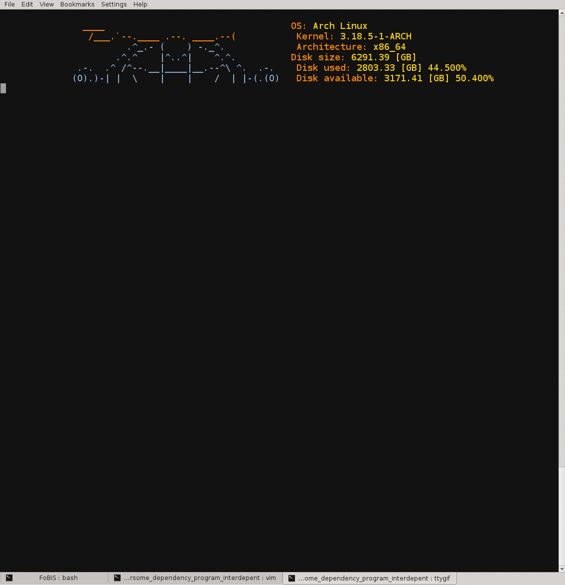

<div align="center">

# FoBiS — Fortran Building System

[](https://pypi.org/project/FoBiS.py/)
[]()
[](https://github.com/szaghi/FoBiS/actions)
[](https://codecov.io/gh/szaghi/FoBiS)
[]()
[]()

[]()

> Automatic dependency-resolving build tool for modern Fortran projects — no makefiles, no boilerplate.
> Package manger highly integrated with GitHub, install and fetch project dependencies.
> Add instrospective doctests to your Fortran project and exploit AI-powered programmatic buildings with the provided AI skill.

<div>
<table>
<tr>
<td><b>⚡ Zero-configuration builds</b><br><sub>Drop FoBiS into any Fortran project and run <code>fobis build</code>. It scans sources, resolves all <code>use</code>, <code>include</code>, and module dependencies automatically, and compiles in the correct order — no makefiles, no boilerplate. <a href="https://szaghi.github.io/FoBiS/guide/quickstart">Quick start</a></sub></td>
<td><b>📄 fobos — the FoBiS makefile</b><br><sub>A concise INI-style configuration file replaces makefiles entirely. Define multiple build modes, templates, variables, and custom rules — all in one readable file. <a href="https://szaghi.github.io/FoBiS/fobos/">fobos reference</a></sub></td>
</tr>
<tr>
<td><b>🌐 GitHub integration</b><br><sub>Declare dependencies in a <code>[dependencies]</code> fobos section — <code>fobis fetch</code> clones, pins to branch/tag/rev, and pre-builds them; <code>fobis build</code> picks them up automatically. Install any GitHub-hosted FoBiS project directly with <code>fobis install user/repo</code>. <a href="https://szaghi.github.io/FoBiS/advanced/fetch">Fetch deps</a> · <a href="https://szaghi.github.io/FoBiS/advanced/install">GitHub install</a></sub></td>
<td><b>🔬 Introspective doctests</b><br><sub>Embed micro-unit-tests directly inside Fortran comment docstrings. FoBiS generates, compiles, and runs volatile test programs automatically — inspired by Python's doctest module, no test harness needed. <a href="https://szaghi.github.io/FoBiS/advanced/doctests">Doctests</a></sub></td>
</tr>
<tr>
<td><b>🤖 JSON output &amp; Claude Code skill</b><br><sub>Pass <code>--json</code> to <code>fobis build</code>, <code>fobis clean</code>, or <code>fobis fetch</code> for machine-readable structured output — ideal for CI and AI agent workflows. Install the bundled <code>/fobis</code> Claude Code skill for expert AI assistance right in your editor. <a href="https://szaghi.github.io/FoBiS/advanced/json-output">JSON output</a> · <a href="https://szaghi.github.io/FoBiS/guide/claude-skill">Claude skill</a></sub></td>
<td><b>🆓 Free and open source</b><br><sub>Released under the GNU GPL v3 license. Free to use, study, modify, and distribute. Contributions welcome — see the <a href="CONTRIBUTING.md">contributing guidelines</a></sub></td>
</tr>
</table>
</div>

**[Full documentation](https://szaghi.github.io/FoBiS/)**

</div>

## Why FoBiS?

Modern Fortran's module system is powerful — but tracking inter-module compilation order by hand in a makefile quickly becomes a nightmare as project size grows. Every time you add a module, rename a file, or restructure directories, the makefile needs manual updates.

**FoBiS solves this completely.** It parses source files on every invocation, rebuilds the dependency graph from scratch, and compiles in the correct order — with no configuration required for simple projects.

```bash
# That's it. FoBiS finds all programs, resolves all dependencies, compiles.
fobis build
```

For complex projects, a single `fobos` file in the project root replaces makefiles entirely:

```ini
[modes]
modes = debug release

[debug]
compiler  = gnu
cflags    = -c -O0 -g -Wall
build_dir = ./build/debug/

[release]
compiler  = gnu
cflags    = -c -O3
build_dir = ./build/release/
```

```bash
fobis build -mode release
```

---

## Projects using FoBiS

- **[ADAM](https://szaghi.github.io/adam/)** — Accelerated fluid Dynamics on Adaptive Mesh refinement grids &nbsp;|&nbsp; [GitHub](https://github.com/szaghi/adam)
- **[BeFoR64](https://szaghi.github.io/BeFoR64/)** — Base64 encoding/decoding library for Fortran &nbsp;|&nbsp; [GitHub](https://github.com/szaghi/BeFoR64)
- **[FACE](https://szaghi.github.io/FACE/)** — Fortran ANSI Colors and Escape sequences &nbsp;|&nbsp; [GitHub](https://github.com/szaghi/FACE)
- **[FiNeR](https://szaghi.github.io/FiNeR/)** — Fortran INI ParseR and generator &nbsp;|&nbsp; [GitHub](https://github.com/szaghi/FiNeR)
- **[FLAP](https://szaghi.github.io/FLAP/)** — Fortran command Line Arguments Parser &nbsp;|&nbsp; [GitHub](https://github.com/szaghi/FLAP)
- **[FUNDAL](https://szaghi.github.io/FUNDAL/)** — Fortran UNified Device Acceleration Library &nbsp;|&nbsp; [GitHub](https://github.com/szaghi/FUNDAL)
- **[FOSSIL](https://szaghi.github.io/FOSSIL/)** — FOrtran Stereo (si) Litography parser &nbsp;|&nbsp; [GitHub](https://github.com/szaghi/FOSSIL)
- **[MORTIF](https://szaghi.github.io/MORTIF/)** — MORTon Indexer (Z-order) Fortran environment &nbsp;|&nbsp; [GitHub](https://github.com/szaghi/MORTIF)
- **[MOTIOn](https://szaghi.github.io/MOTIOn/)** — Modular (HPC) Optimized Toolkit (for) IO (in fortra)n &nbsp;|&nbsp; [GitHub](https://github.com/szaghi/MOTIOn)
- **[PENF](https://szaghi.github.io/PENF/)** — Portability Environment for Fortran &nbsp;|&nbsp; [GitHub](https://github.com/szaghi/PENF)
- **[StringiFor](https://szaghi.github.io/StringiFor/)** — Strings Fortran Manipulator with steroids &nbsp;|&nbsp; [GitHub](https://github.com/szaghi/StringiFor)
- **[VecFor](https://szaghi.github.io/VecFor/)** — Vector algebra class for Fortran &nbsp;|&nbsp; [GitHub](https://github.com/szaghi/VecFor)
- **[VTKFortran](https://szaghi.github.io/VTKFortran/)** — pure Fortran VTK (XML) API &nbsp;|&nbsp; [GitHub](https://github.com/szaghi/VTKFortran)

---

## Author

**Stefano Zaghi** — [stefano.zaghi@cnr.it](mailto:stefano.zaghi@cnr.it) · [GitHub](https://github.com/szaghi)

## Copyrights

FoBiS is an open source project distributed under the [GPL v3](http://www.gnu.org/licenses/gpl-3.0.html) license. Anyone interested in using, developing, or contributing to FoBiS is welcome — see the [contributing guidelines](CONTRIBUTING.md).

---


