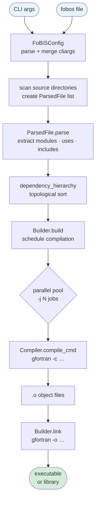
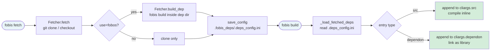

# Architecture Guide

This page describes how FoBiS.py's internal modules interact and how data flows through the system during a build, fetch, or install run. It is intended for contributors who want to understand the codebase before making changes.

## Module Map

| Module | Responsibility |
|--------|---------------|
| `fobis.fobis` | Entry point — dispatches CLI subcommands to the right subsystem |
| `fobis.FoBiSConfig` | Parses CLI arguments and fobos file; merges them into a single `cliargs` namespace used by all other modules |
| `fobis.cli` | Typer application and per-command submodules; translates raw CLI input into normalized `cliargs` |
| `fobis.ParsedFile` | Parses a single Fortran source file; extracts module definitions, `use` statements, `include` directives, and program declarations |
| `fobis.Builder` | Orchestrates compilation: orders files by dependency, drives parallel compilation, links the final executable or library, and optionally generates a GNU Makefile |
| `fobis.Compiler` | Compiler abstraction: assembles compile and link flag strings for all supported vendors (GNU, Intel, AMD, NAG, IBM, …) and feature variants (MPI, OpenMP, coarray, coverage) |
| `fobis.Fobos` | Reads and resolves fobos INI files: mode selection, template inheritance, local variable substitution, and custom rule execution |
| `fobis.Fetcher` | Clones GitHub-hosted dependencies, builds `use=fobos` deps, installs artifacts, and writes `.fobis_deps/.deps_config.ini` |
| `fobis.Doctest` | Extracts inline doctest snippets from Fortran comment blocks, generates temporary programs, compiles and runs them |
| `fobis.utils` | Shared helpers: subprocess wrappers (`syswork`), directory utilities, dependency-hierarchy topological sort, result checking |

## Build Data-Flow

### Step-by-step

1. **`FoBiSConfig`** merges CLI flags with any matching fobos section into a single `cliargs` `argparse.Namespace`. CLI flags always win over fobos values.
2. **Source scan** — `FoBiSConfig.parse_files()` walks every directory in `cliargs.src`, creates a `ParsedFile` per source file, and calls `ParsedFile.parse()` on each.
3. **`ParsedFile.parse()`** applies regex patterns to extract:
   - `module <name>` / `submodule (<parent>) <name>` definitions
   - `use [, intrinsic ::] <name>` dependencies (intrinsics filtered out)
   - `include "<file>"` / `include '<file>'` dependencies
   - Presence of a `program` statement
4. **`dependency_hierarchy()`** (in `utils.py`) performs a topological sort over the parsed dependency graph and returns a compilation-ordered list.
5. **`Builder.build()`** walks the ordered list. Independent files are batched into a `multiprocessing.Pool` for parallel compilation (controlled by `cliargs.jobs`). Each file is compiled with the command returned by `Compiler.compile_cmd()`.
6. **`Builder` links** all objects into the final executable or library using `Compiler.link_cmd()`.

## Fetch Data-Flow

### Integration modes

Each dependency in the fobos `[dependencies]` section carries a `use=` option:

| `use=` | What `fobis fetch` does | What `fobis build` does |
|--------|------------------------|------------------------|
| `sources` *(default)* | Clone only | Adds dep dir to source scan — compiled inline with the project |
| `fobos` | Clone + `fobis build` inside dep | Adds dep fobos to `dependon` — links against the pre-built library |

The bridge between the two commands is `.fobis_deps/.deps_config.ini`, written by `Fetcher.save_config()` and read by `FoBiSConfig._load_fetched_deps()` at the start of every `fobis build` run.

## Extension Points

### Adding a new compiler

All compiler knowledge lives in `fobis/Compiler.py`. The constructor reads `cliargs.compiler` and branches on a known set of vendor strings. To add a new vendor:

1. Add its canonical name to `__compiler_supported__` in `fobis/cli/_constants.py`.
2. Add an `elif cliargs.compiler == "myvendor":` block in `Compiler.__init__()` setting `self.fcs`, `self.cflags`, `self.lflags`, and `self.modsw`.
3. Add MPI, OpenMP, coarray, and coverage flag variants in the corresponding `if cliargs.mpi` / `if cliargs.openmp` sections.
4. Add a parametrized row to `tests/unit/test_compiler.py`.

### Adding a new CLI subcommand

The CLI lives in `fobis/cli/`. Each subcommand is a self-contained module:

1. Create `fobis/cli/mycommand.py` with an `@app.command("mycommand")` function.
2. Import it in `fobis/cli/__init__.py` so the decorator fires at import time.
3. Add shared options via the type aliases in `fobis/cli/_options.py`; inline `Annotated[...]` for command-specific options.
4. Dispatch the new command in `fobis/fobis.py` inside `run_fobis()`.

### Adding a new fobos section

Fobos sections are read by `fobis/Fobos.py` using the standard `configparser` API:

1. Add a `get_mysection()` method to `Fobos` that calls `self.fobos.has_section("mysection")` and `self.fobos.get("mysection", "mykey")`.
2. Call it from `FoBiSConfig` after `Fobos` is constructed and merged into `cliargs`.
3. Document the new keys in `docs/fobos/`.
