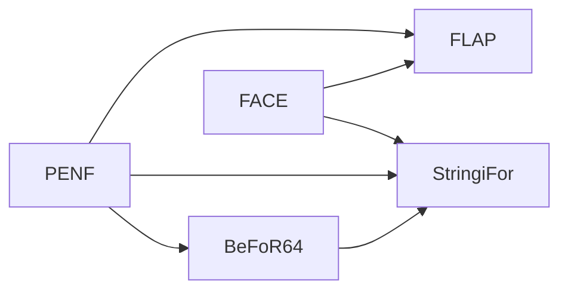
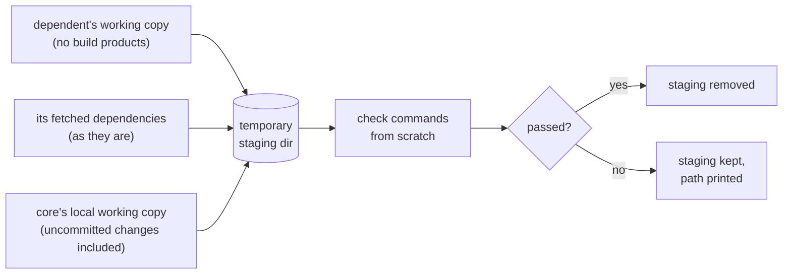
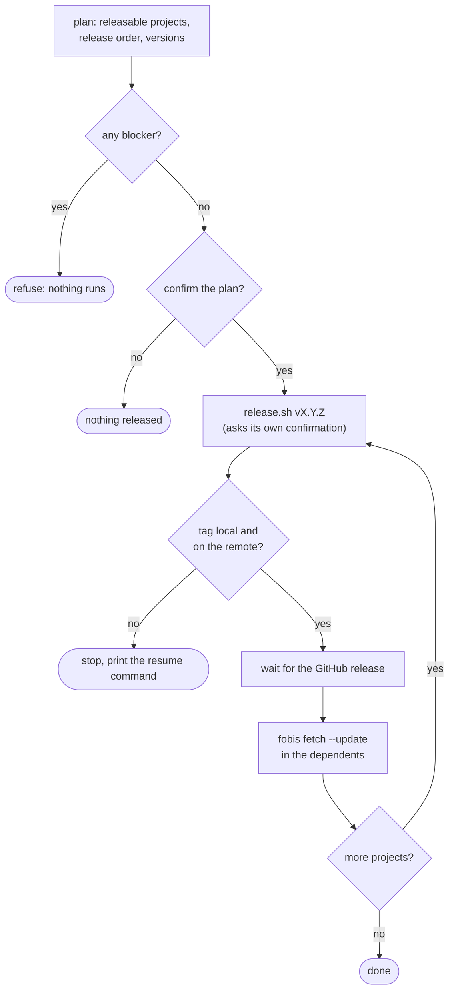

# Ecosystem: Managing Interconnected Projects

FoBiS builds one project at a time. Real Fortran work rarely stops at one project: a portability
layer is used by a string library, which is used by a command-line parser, which is used by your
application. Each lives in its own repository, with its own tags, CI and boilerplate — and every
change at the bottom of the stack ripples upwards.

`fobis ecosystem` manages such a set of interconnected FoBiS projects as a whole:

- **know** the state of every repository at a glance — branch, uncommitted changes, unreleased
  commits and the version they call for, CI result, scaffold drift, and whether each project is
  built against the current head of its dependencies;
- **act** across all of them in dependency order — run a command everywhere, refresh the fetched
  dependencies, sync the boilerplate, and check *before releasing* that a change does not break
  the projects downstream;
- **release** them as a train — every project that needs it, dependencies first, each with the
  version its commits call for, stopping safely at the first failure.


::: tip Read-only by default
Knowing never changes anything: `discover`, `graph` and `dashboard` only read (the dashboard runs
`git fetch`, which only updates remote-tracking refs). Nothing ever commits or pushes except
`release`, and only after you confirm the plan.
:::

## Concepts

### The registry

An ecosystem is an **explicit list** of local repositories, kept in your user configuration
(`~/.config/fobis/config.ini`, or `$XDG_CONFIG_HOME/fobis/config.ini`):

```ini
[ecosystem]
root     = ~/fortran
projects = PENF FACE BeFoR64 StringiFor FLAP
```

Nothing is managed by accident: a directory full of archives and experiments stays out of the
ecosystem until you register a project with [`fobis ecosystem add`](#_1-register-the-projects).
Every project is a git repository with a `fobos` file; its **name** is its directory name.

### The dependency graph

There is no extra graph file: the edges come from each project's own fobos `[dependencies]`
section — the one `fobis fetch` already uses. A dependency is an *ecosystem dependency* when its
key, or the repository name of its URL, matches a registered project (case-insensitively); any
other dependency (say `stdlib`) is *external*: listed, not managed.



From the graph FoBiS derives the **release order**: projects are grouped in *levels*, each one
level above its deepest dependency. Level 0 has no ecosystem dependency; releasing level by level
never releases a project before one of its dependencies. Every acting command walks the projects in
this order.

| Level | Projects | Why |
|:-----:|----------|-----|
| 0 | PENF, FACE | no ecosystem dependency |
| 1 | BeFoR64, FLAP | depend on level-0 projects only |
| 2 | StringiFor | depends on BeFoR64 (level 1) |

A dependency cycle is reported, never looped on: the projects on it are left out of the order.

### Pins: following the heads

Ecosystem projects typically track the **default branch** of their dependencies rather than pinning
a release, so that a fix at the bottom of the stack reaches the dependents without a cascade of
version bumps. What a project is actually built against is recorded by `fobis fetch` in the lock
file `<deps_dir>/fobos.lock`. A **pin** compares that locked commit with the dependency's remote
default-branch head:

| Pin | Meaning | Fix |
|-----|---------|-----|
| `current` | built against the dependency's head | — |
| `stale` | the head has moved on since the last fetch | `fobis ecosystem fetch` |
| `ahead` | the lock is newer than the head FoBiS knows | `git fetch` the dependency (drop `--no-fetch`) |
| `diverged` | lock and head on unrelated histories | inspect the dependency |
| `unlocked` | the dependency was never fetched | `fobis fetch` in the project |
| `unknown` | the dependency has no remote head | push the dependency |

### The release rule

Whether a project needs a release is decided by the **files** its commits change; how big a
release by their [Conventional Commits](https://www.conventionalcommits.org/) **type**.

1. A commit since the latest tag is *releasable* when it changes at least one file outside the
   release-excluded globs — by default `docs/*`, `.github/*`, `*.md` and `scripts/*`. A docs-only
   or CI-only commit is unreleased, but calls for no release, whatever its type.
2. The bump comes from the releasable commits only: a `!` after the type/scope or a
   `BREAKING CHANGE` footer means **major**, `feat` means **minor**, anything else (including a
   non-conventional message) means **patch**.

| Commit | Files changed | Releasable | Bump |
|--------|---------------|:----------:|:----:|
| `fix(docs): target es2022` | `docs/package.json`, `scripts/release.sh` | no | — |
| `build(fpm): track default branches` | `fpm.toml` | yes | patch |
| `feat(core): add halve()` | `src/core_m.f90` | yes | minor |
| `refactor(api)!: rename twice` | `src/core_m.f90` | yes | major |

Commit types are written by hand and are sometimes wrong; the files a commit touches are not. A
project replaces the default globs in its own fobos:

```ini
[ecosystem]
release_exclude = docs/* .github/* *.md scripts/* examples/*
```

## Try it in one minute

The documentation ships a script that builds a small, private ecosystem — three real Fortran
projects (`core` ← `mathx` ← `app`) with history, tags, local remotes and fetched dependencies.
Nothing leaves the directory you give it, so you can release, break and repair at will:

```bash
bash docs/demo/ecosystem-demo/setup.sh ~/eco-demo
source ~/eco-demo/env.sh          # selects the demo registry; the demo URLs resolve locally
cd ~/eco-demo

fobis ecosystem graph
fobis ecosystem dashboard --no-ci
fobis ecosystem check core
fobis ecosystem release --dry-run
```

It needs `git` and `gfortran`, plus `git-cliff` for the release pre-flight. Remove it with
`rm -rf ~/eco-demo`. All the animations on this page are recorded on it.

## 1. Register the projects

`discover` scans one directory (the configured `root`, or `--root`) for git repositories with a
fobos file that are not registered yet, and prints the command that would register them. It only
reads: pick the candidates you actually want to manage.

```bash
fobis ecosystem discover
```

```
Unregistered FoBiS projects under /home/me/fortran:
  adam
  FiNeR
  FLOw
  ...

Register the ones you want to manage (not necessarily all):
  fobis ecosystem add adam FiNeR FLOw ...
```

`add` and `remove` edit the registry for you:

```bash
fobis ecosystem add FiNeR FOODIE          # names under root
fobis ecosystem add ~/work/MyLib          # or any path
fobis ecosystem remove FOODIE             # the repository itself is not touched
```

- `add` accepts only git repositories with a fobos file, whose directory name no registered
  project has (the name identifies the project). An already registered one is reported and skipped.
- A project directly under `root` is written as its bare name, any other as a `~/...` path.
- `remove` tells you which registered projects still depend on the one you remove (it becomes an
  external dependency for them).
- Both are **all-or-nothing** — one invalid argument and the configuration is not touched — and
  rewrite only the `projects` key: the rest of the file, comments included, stays as it is.

## 2. Know: graph and dashboard

### The graph

```bash
fobis ecosystem graph
```

```
Release order (dependencies first)
   1. PENF  (level 0)
   2. FACE  (level 0)
   3. BeFoR64  (level 1)
   4. FLAP  (level 1)
   5. StringiFor  (level 2)

Dependency tree
StringiFor
|-- BeFoR64
|   `-- PENF
|-- FACE
`-- PENF
FLAP
|-- FACE
`-- PENF
```

### The terminal dashboard

```bash
fobis ecosystem dashboard
```

```
Project     Branch  Tree   Upstream  Version / tag      Unreleased                         CI       Drift  Pins
----------  ------  -----  --------  -----------------  ---------------------------------  -------  -----  ----------------------
PENF        master  clean  in sync   v2.0.1 / v2.0.1    1, none to release                 passing  3      -
FACE        master  clean  in sync   v1.1.16 / v1.1.16  1, none to release                 passing  3      -
BeFoR64     master  clean  in sync   v1.2.1 / v1.2.1    3 (patch -> v1.2.2)                passing  3      PENF stale
StringiFor  master  clean  in sync   v1.3.0 / v1.3.0    6 (patch -> v1.3.1)                passing  3      BeFoR64 stale
FLAP        master  clean  in sync   v2.5.1 / v2.5.1    2, 1 to release (patch -> v2.5.2)  passing  3      FACE stale, PENF stale
```

How to read a row:

| Column | Shows | Needs attention when |
|--------|-------|----------------------|
| **Tree** | `clean`, or the number of changed and untracked files | anything but `clean` |
| **Upstream** | `in sync`, `+ahead/-behind`, or `no upstream` | not in sync |
| **Version / tag** | the `VERSION` file against the latest tag | they differ (highlighted) |
| **Unreleased** | commits since the tag; how many are releasable; the bump and next version | something to release |
| **CI** | GitHub Actions result for HEAD: `passing`, `failing`, `running`, `none`, `not pushed`, `unknown` | `failing` |
| **Drift** | scaffold-managed files not in sync (project-owned ones excluded) | non-zero |
| **Pins** | ecosystem dependencies not at their head | `stale`, `unlocked`, `diverged` |

The dashboard runs `git fetch` in every project first (quietly; it only updates remote-tracking
refs), because *ahead/behind*, *CI at HEAD* and the *dependency heads* are only right after a fetch.
All projects are examined concurrently. `--no-fetch` gives a fast, offline view of the last fetch;
`--no-ci` skips GitHub entirely. CI goes through the [`gh`](https://cli.github.com/) CLI: without it,
or unauthenticated, the column reads `unknown` and nothing fails.

### The HTML dashboard

```bash
fobis ecosystem dashboard --format html
```

writes a self-contained page (default `~/.cache/fobis/ecosystem.html`) and opens it in the browser:
the same table, links to every repository, its Actions and its releases, the release order, and the
dependency diagram with every node coloured by the most severe state of its project — CI failing,
stale pins, changes to release, up to date.


The page has *Theme* and *Mode* selectors that switch live and are remembered by the browser.
Nine popular palettes are built in, each with a light and a dark variant:

| `theme` | Light | Dark |
|---------|-------|------|
| `github` *(default)* | GitHub Light | GitHub Dark |
| `solarized` | Solarized Light | Solarized Dark |
| `dracula` | Alucard | Dracula |
| `nord` | Snow Storm | Nord |
| `tokyo-night` | Tokyo Night Day | Tokyo Night |
| `catppuccin` | Latte | Mocha |
| `gruvbox` | Gruvbox Light | Gruvbox Dark |
| `one` | One Light | One Dark |
| `rose-pine` | Rosé Pine Dawn | Rosé Pine |

`mode` is `auto` (follow the system, live), `light` or `dark`. Set your defaults once in the user
configuration (`theme = nord`, `mode = auto` in `[ecosystem]`), or per run with `--theme`/`--mode`.
Every colour derives from the palette, and secondary, link and status text is darkened or lightened —
keeping its hue — until it reaches a 4.5:1 contrast with the background.

::: tip On WSL
A Windows browser cannot open a `file:///home/...` path. Write the page and open it from Windows:
`fobis ecosystem dashboard --format html --no-open && explorer.exe "$(wslpath -w ~/.cache/fobis/ecosystem.html)"`
:::

### For scripts and agents

`dashboard --json` and `graph --json` print everything above as JSON: one object per project with
every field, plus the levels, the release order and any cycle. See the
[JSON reference](/reference/ecosystem#json-output).

```bash
# projects with something to release
fobis ecosystem dashboard --no-ci --json | jq -r '.projects[] | select(.releasable > 0) | .name'
```

## 3. Act across the projects

Every acting command walks the projects in **release order**, streams each command's output live
under a `==> PROJECT: command` header, and ends with a summary table; it exits 1 when a project
failed. `--only A,B` restricts the projects, `--from X` resumes after a failure, `--fail-fast` stops
at the first one.

### Run a command everywhere: `exec`

```bash
fobis ecosystem exec -- git status -s
fobis ecosystem exec -- 'fobis clean && fobis build'
fobis ecosystem exec --only PENF,FACE --fail-fast -- fobis test
```

```
==> PENF: git log -1 --format=%h && test $(basename $PWD) != FLAP
34e10af

==> FLAP: git log -1 --format=%h && test $(basename $PWD) != FLAP
7f5ec8e

Project  Result        Time  Detail
PENF     passed        0.0s
FLAP     failed        0.0s  exit 1

1 passed, 1 failed: FLAP
```

A single argument is a shell command line (quote it), several form one command. A non-zero exit is
a *failure*, a death by signal a *crash* (reported with the signal, e.g. `SIGSEGV`). `fobis` and
`FoBiS.py` inside the command — and inside the fobos rules it runs — resolve to the FoBiS running
`exec`, not to whichever one the `PATH` finds first.

### Refresh the dependencies: `fetch`

```bash
fobis ecosystem fetch
```

runs `fobis fetch --update` in every project with a `[dependencies]` section, dependencies first, so
that each lock ends at the current heads: the *Pins* column turns `current`.

### Check before you release: `check`

The question before releasing a library is not *does it pass its own tests* — its CI answers that —
but *does it break the projects that use it*. `check` answers it with your **local, unreleased
working copy**, uncommitted changes included, without touching any repository:

```bash
fobis ecosystem check core
```


For every project that depends on `core`, directly or transitively, in release order:



1. its working copy (tracked and untracked files; ignored files such as build products excluded)
   is copied to a temporary directory;
2. its dependencies are copied in as it has fetched them — except the checked project, taken from
   its local working copy;
3. its check commands run there, from scratch: no stale object can leak into the result.

The check commands come from the dependent's fobos, in order of precedence:

| Source | Commands |
|--------|----------|
| `[ecosystem] check` | one command per line |
| a `[rule-makecoverage]` | `fobis rule --ex makecoverage` — what the CI runs |
| otherwise | `fobis build` |

```ini
[ecosystem]
check = fobis build --mode tests-gnu
        ./scripts/run_tests.sh
```

The staging directories are removed after a full pass and kept — their path printed — when a check
fails, for inspection (`--keep` keeps them always). A dependent whose dependencies were never
fetched is reported as `skipped`; `check` exits 1 unless every dependent passed.

### Sync the boilerplate: `scaffold`

```bash
fobis ecosystem scaffold status                    # what drifts, project by project (exit 1 if any)
fobis ecosystem scaffold sync                      # show the changes: writes nothing
fobis ecosystem scaffold sync --apply              # confirm and write, project by project
fobis ecosystem scaffold sync --files 'scripts/*' --apply --yes
```

These are the [scaffold](/advanced/scaffold) commands, run across every project. A file a project
has deliberately customised is declared in its fobos and never written:

```ini
[scaffold]
# release.sh also bumps the CMake project version: owned here, never synced
skip = scripts/release.sh
```

It shows as `SKIPPED (project-owned)` and does not count as drift, here and in plain
`fobis scaffold` alike. With `--apply` each project's changes are confirmed (default *no*); when no
answer is possible — no terminal — nothing is written.

## 4. Release: the release train

```bash
fobis ecosystem release --dry-run          # the plan, nothing else
fobis ecosystem release                    # the train
```




**1. The plan.** After a fetch and a CI query, every project with releasable commits is listed in
release order with the version it will get. Override a suggestion with
`--bump NAME=major|minor|patch` or an explicit `--bump NAME=vX.Y.Z` (repeatable); `--bump` also
brings into the plan a project with nothing releasable.

```
Release plan (dependencies first)
   1. BeFoR64     v1.2.1 -> v1.2.2        ready  (patch, 3 releasable commit(s))
   2. FLAP        v2.5.1 -> v2.5.2        BLOCKED  (patch, 1 releasable commit(s))
        x working tree not clean (1 changed)
   3. StringiFor  v1.3.0 -> v1.3.1        ready  (patch, 6 releasable commit(s))
```

**2. Pre-flight, for every project before anything runs.** A single blocker refuses the whole
train — no half-released ecosystem:

| Blocks the train | Only warns |
|------------------|------------|
| no executable `scripts/release.sh` | unpushed commits (CI has not seen them) |
| `git-cliff` missing | CI not passing yet (`running`, `none`, `unknown`) |
| not on the trunk branch | not fetched (`--no-fetch`) |
| uncommitted changes | not on GitHub (the release cannot be awaited) |
| behind the upstream, or no upstream | |
| CI failing at HEAD | |
| no previous tag and no explicit version | |
| version not above the current tag, or already tagged | |

**3. Confirmation** of the plan as a whole (default *no*). Then each project's own
`scripts/release.sh` runs with the planned version — the version you approved is exactly the one
tagged — and asks *its own* confirmation, as when you run it by hand.

**4. For each project**, after `release.sh`:

- the tag must exist **locally and on the remote** — `release.sh` exits successfully when you
  decline its prompt, and that is reported as `aborted`, never as a release;
- the GitHub release published by the project's release workflow is awaited (`--timeout`,
  default 900 s; `--no-wait` skips it);
- `fobis fetch --update` runs in its dependents, so they build against the new release.

**5. On failure** the train stops and prints the command that resumes it:

```
Stopped at FLAP. Fix it, then resume with: fobis ecosystem release --from FLAP --bump FLAP=minor
```

Projects already released drop out of the plan by themselves (their new tag leaves them nothing to
release), so resuming never releases anything twice.

::: warning --yes
`--yes` approves the plan *and* answers every `release.sh` prompt. Use it only for an unattended run
of a plan you have already reviewed with `--dry-run`.
:::

## Recipes

### Morning check

```bash
fobis ecosystem dashboard                  # what changed, what is red, what is stale
fobis ecosystem fetch                      # bring every pin to the current heads
```

### Upgrading FoBiS: re-sync the boilerplate

```bash
pip install -U FoBiS.py
fobis ecosystem scaffold status
fobis ecosystem scaffold sync              # review the diffs
fobis ecosystem scaffold sync --apply      # write, project by project
fobis ecosystem exec -- git status -s      # then review and commit in each repository
```

### Changing a library at the bottom of the stack

```bash
# hack on PENF, do not commit yet
fobis ecosystem check PENF                 # do BeFoR64, FLAP, StringiFor still build and pass?
git -C ~/fortran/PENF commit -am "feat(io): ..." && git -C ~/fortran/PENF push
fobis ecosystem release --dry-run          # PENF, and anything else that needs a release
fobis ecosystem release
```

### Clean builds everywhere

FoBiS skips up-to-date objects, so an object built with other flags can survive a flag change. To
rule that out across the ecosystem:

```bash
fobis ecosystem exec -- 'fobis clean && fobis build'
```

### In CI or a cron job

```bash
fobis ecosystem dashboard --json > ecosystem.json
fobis ecosystem scaffold status            # exit 1 on drift
fobis ecosystem release --dry-run          # exit 1 when a planned release is blocked
```

## Configuration summary

**User configuration** (`~/.config/fobis/config.ini`):

```ini
[ecosystem]
root     = ~/fortran                      ; where the projects live
projects = PENF FACE BeFoR64 StringiFor   ; names under root, or paths
           FLAP                           ; (continuation lines are fine)
theme    = catppuccin                     ; HTML dashboard palette
mode     = auto                           ; auto | light | dark
```

**Per project** (its `fobos`):

```ini
[ecosystem]
check           = fobis build --mode tests-gnu      ; check commands, one per line
                  ./scripts/run_tests.sh
release_exclude = docs/* .github/* *.md scripts/*   ; changes that call for no release

[scaffold]
skip = scripts/release.sh                           ; customised files scaffold never writes
```

## Safety guarantees

- **Nothing is managed by accident**: only registered projects, registered explicitly.
- **Knowing never writes**: `discover`, `graph` and `dashboard` only read (plus `git fetch`).
- **No commit, no push** outside `release`; `release` only after you confirm the plan, and each
  `release.sh` asks again.
- **No consent, no write**: a confirmation that cannot be answered (no terminal) counts as *no* —
  for `release`, `scaffold sync --apply` and plain `fobis scaffold sync` alike.
- **`check` never touches a repository**: it builds copies.
- **The configuration keeps its comments**: `add` and `remove` rewrite only the `projects` key,
  atomically.
- **Failures stop the train** with an exact resume command; a declined release is never mistaken
  for a successful one.

## Troubleshooting

**CI reads `unknown` everywhere.** `gh` is missing or not authenticated (`gh auth status`), or the
`origin` remote is not on GitHub.

**A pin stays `stale` after `fobis ecosystem fetch`.** Pins compare with the dependency's *remote*
head: commits you have not pushed to the dependency do not count.

**`check` reports `skipped: dependency X not fetched`.** The dependent never ran `fobis fetch`: run
`fobis ecosystem fetch`, or `fobis fetch` in that project.

**A release is `aborted`.** `release.sh` did not create the tag — usually its prompt was declined.
Nothing was pushed; re-run the train.

**`release` refuses with `git-cliff not found`.** The scaffolded `release.sh` regenerates the
changelog with [git-cliff](https://git-cliff.org): `pipx install git-cliff`.

## See also

- [`fobis ecosystem` command reference](/reference/ecosystem) — every option, exit code and JSON field
- [Fetch dependencies](/advanced/fetch) and [Lock file](/advanced/lock-file) — the `[dependencies]` section and `fobos.lock`
- [Scaffold](/advanced/scaffold) — the boilerplate the ecosystem keeps in sync
